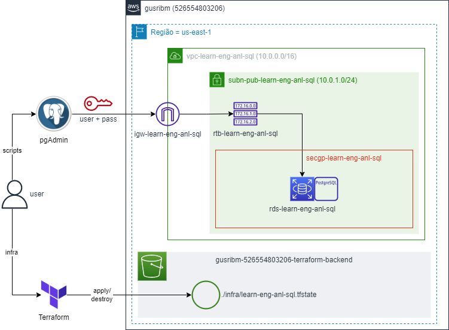
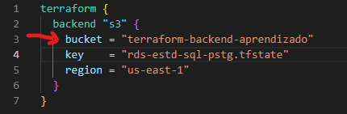

# learn-analytics-engineer-sql
Repositório para estudo de SQL no contexto da Engenharia de Analytics.

---

# SQL para Análise de Dados e Data Science

Arquitetura utilizada para os estudos:



* Plataforma = AWS
* SGBD = PostgreSQL
* IDE = pgAdmin
* Infraestrutura = Terraform
* Backend Terraform = S3

## Criando e Destruindo a Infraestrutura

> **Pré-requisistos**
>
> * Instalar o Terraform;
> * Ter uma conta na AWS;
> * Criar um usuário programático no AWS IAM com par de chaves (Secret + Access Key);
> * Conceder acessos de criação de recursos de rede, security group e RDS para o user.

Para criar sua infraestrutura:

* Acesse o arquivo `./infraestrutura/backend.tf` e altere o nome do Bucket onde o tfstate do Terraform será salvo para um bucket pessoal seu;



* Insira sua Access Key e Secret Key no arquivo `meu_computador/seu_usuario/.aws/Credentials`;
* No repositório `./infraesturtura` execute os seguintes comandos:

```bash
terraform init

terraform plan

terraform apply --auto-approve
```

Quando terminar os estudos, destrua a infraestrutura com o seguinte comando:

```bash
terraform destroy --auto-approve
```