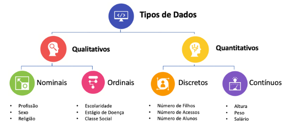
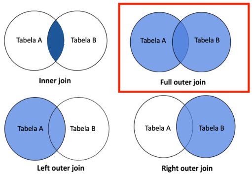
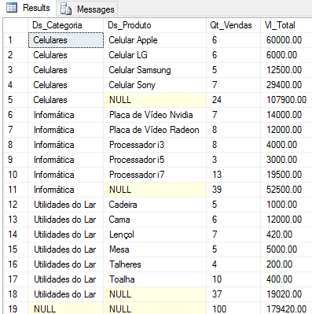
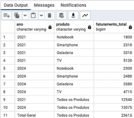
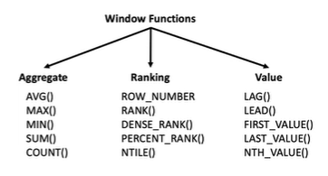
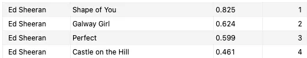
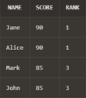
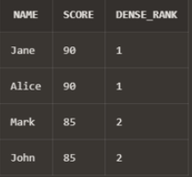
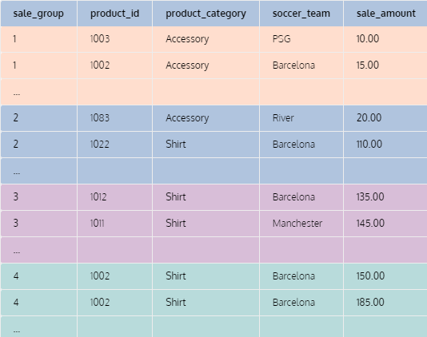
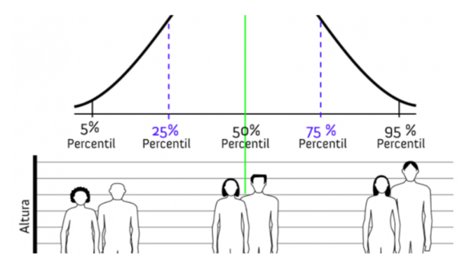

## Teoria

### Anatomia de uma Query SQL

**Plano de Execução de uma Query**: procedimento/sequência a ser executada (anatomia) em uma query;

1. FROM
2. ON
3. JOIN
4. WHERE
5. GROUP BY
6. WITH CUBE OU WITH ROLLUP
7. HAVING
8. SELECT
9. DISTINCT
10. ORDER BY

Porém, a sequência pode variar em alguns casos, como quando o otimizador de consultas do SQL Server usa índices.

---

### Tipos de dados

**Quantitativos**

São aqueles que expressam uma quantidade e podem ser mensurados em escala numérica. Os dados quantitativos podem ser divididos em:

* **Discretos**: resultados de contagens e só assumem valores inteiros;
* **Contínuos**: mensurações que podem assumir qualquer valor real em um intervalo.

**Qualitativos**

Representam características que não podem ser medidas em uma escala numérica, mas podem ser categorizadas ou descritas. São classificados em:

* **Nominais**: representam categorias sem uma ordem implícita. Por exemplo: cor dos olhos (azul, verde, castanho), tipo sanguíneo (A, B, AB, O), marcas de carros (Ford, Toyota, Honda);
* **Ordinais**: representam categorias com uma ordem ou graduação específica. No entanto, a distância entre as categorias não é uniforme ou conhecida. Exemplos incluem níveis de escolaridade (fundamento, médio, superior), graus de satisfação em uma pesquisa (insatisfeito, indiferente, satisfeito) e classificações (primeiro, segundo, terceiro);



---

### Categorização

A categorização em variáveis numéricas, no contexto da análise de dados, refere-se ao processo de transformar dados numéricos contínuos ou discretos em categorias ou grupos discretos. Esse processo é também frequentemente chamado de "binning" ou "bucketing".

A ideia é simplificar a análise ou visualização de distribuições numéricas, ou preparar os dados para algoritmos que operam melhor com dados categóricos.

Razões para categorizar variáveis numéricas:

* **Simplificação de análise**: categorizar dados numéricos pode simplificar a interpretação, especialmente quando há uma grande variedade de valores numéricos;

* **Visualização**: em alguns casos, é mais intuitivo visualizar dados categóricos do que dados numéricos contínuos (Histogramas, por exemplo);

* **Tratamento de Outliers**: a categorização pode ajudar a lidar com outliers, agrupando valores extremos em categorias mais amplas;

* **Preparação para Modelos Específicos**: alguns modelos de machine learning podem exigir, ou operar melhor, com características em vez de numéricas.

O processo de categorização em variáveis numéricas geralmente envolve:

* **Definição de Intervalos**: escolher os limites que definirão as categorias. Isso pode ser feito com base em intervalos de igual tamanho, percentis ou utilizando conhecimento específico do domínio;

* **Transformação**: convertendo valores numéricos nas categorias definidas com base nos intervalos escolhidos;

* **Rotulação (opcional)**: em vez de usar os intervalos como rótulos, pode-se atribuir rótulos mais descritivos às categorias, como "baixo", "médio" e "alto".

---

### Codificação/ Encoding

No contexto da análise de dados e processamento de dados para modelagem preditiva ou machine learning, "codificação" ou "encoding" refere-se ao processo de converter dados categóricos ou textuais em um formato numérico que pode ser usado por algorítmos.

Existem várias técnicas de codificação e a escolha da técnica pode depender da natureza dos dados e do algoritmo específico que se planeja usar. Algumas das técnicas de codificação mais comuns incluem:

* **Codificação One-Hot**: cada categoria de uma variável é convertida em uma nova coluna binária (0 ou 1);


* **Codificação por Rótulo**: cada categoria recebe um valor inteiro. Esta abordagem pode ser problemática para algoritmos que interpretam a natureza ordinal dos números, a menos que haja uma ordem inerente às categorias;

* **Codificação por Frequência ou Contagem**: categorias são codificadas com base em sua frequência ou contagem no dataset. Isso pode ser útil quando uma categoria particular tem significado por sua prevalência, mas pode ser problemático se as frequências forem muito semelhantes entre categorias;

* **Codificação Target**: categorias são codificadas com base na média do valor alvo para essa categoria. Por exemplo, em um problema de classificação binária, as categorias podem ser codificadas pela média de resultados positivos para cada categoria;

* **Codificação Binária**: combina a codificação one-hot e a codificação por rótulo, representando os rótulos codificados numericamente em formato binário;

* **Codificação Baseada em Aprendizado (Embedding Encoding)**: usada principalmente com redes neurais, onde categorias são representadas como vetores densos em um espaço n-dimensional. Estes vetores são aprendidos durante o treinamento da rede neural. Essa técnica é usada em Inteligencia Artificial.

Ao escolher uma técnica, é importante considerar o tipo de modelo a ser usado, a relação entre a característica categórica e a variável alvo, e o potencial de introduzir ruído ou multicolinearidade nos dados.

Em alguns casos, pode ser benéfico experimentar várias técnicas de codificação para determinar qual oferece o melhor desempenho para um modelo específico.

---

### Binarização

No contexto de análise e processamento de dados, refere-se ao processo de converter dados numéricos ou categóricos em formato binário, ou seja, em valores 0 ou 1. Isso pode ser útil por diversas razões, incluindo a simplificação de dados, preparação para certos algoritmos ou até mesmo a extração de características relevantes de imagens em processamento de imagens.


Contextos em que a binarização é aplicada:

* **Análise e Processamento de Dados**: converter variáveis contínuas em formatos binários com base em um limiar. Por exemplo, converter uma variável como "idade" em "maior de 18 anos" (1 se verdadeiro, 0 se falso);

* **Processamento de Imagens**: envolve a conversão de imagens em tons de cinza para imagens binárias, onde os pixels são marcados como 0 (preto) ou 1 (branco) com base em um limiar de intensidade. Isso é útil para o reconhecimento de padrões e outras tarefas;

* **Preparação de Dados para Modelagem**: certos algorítmos, especialmente ous mais simples ou aqueles baseados em árvores, podem se beneficiar da simplificação de dados contínuos em formatos binários. A binarização pode ajudar a destacar relações não lineares entre características e a variável alvo;

* **Engenharia de Características (Feature Engineering)**: as criações de novas características binárias pode ajudar a destacar determinadas relações nos dados. Por exemplo, a partur de uma variável média de renda, criar uma característica binária "renda_acima_da_média" que indica se a renda de um indivíduo está acima da média da amostra.

Ao realizar a binarização, é importante escolher limiares ou critérios apropriados para a conversão, para que a informação útil não seja perdida e para que a transformação seja relevante para o objetivo da análise ou modelagem.

---

## Label Encoding x One-Hot Encoding

Label Encoding e One-Hot Encoding são técnicas utilizadas para converter variáveis categóricas em uma forma numérica que modelos de aprendizado de máquina podem entender. A escolha entre essas técnicas depende muitas vezes da natureza da variável categórica e do modelo específico que você está utilizando.

Em Label Encoding, a cada categoria é atribuído um valor único, entre 1 e N.

**Vantagens**:

* Economiza espaço, pos você tem apenas uma coluna com valores inteiros em vez de várias colunas binárias;

* Pode ser útil para modelos baseados em árvore (como árvores de decisão e random forests) que são capazes de lidar com variáveis categóricas codificadas dessa forma.

**Desvantagens**:

* Introduz uma ordem arbitrária às categorias, o que pode não ser representativo da natureza da variável. Por exemplo, se tivermos uma variável "cor" com valores "vermelho", "azul" e "verde", e elas são codificadas como 1, 2 e 3 respectivamente, isso pode sugerir que "verde" (3) é de alguma forma "maior" ou "melhor" que "azul" (2) e "vermelho" (1), o que pode não ser verdadeiro e pode levar a resultados indesejados em alguns modelos.

Em One-Hot Encoding, para cada categoria da variável categórica, é criada uma nova coluna binária chamada de `variável dummy`. Para um dado registro, a coluna correspondente à sua categoria recebe o valor 1 e todas as outras colunas recebem o valor 0.


**Vantagens**:

* Não introduz uma ordem arbitrária às categorias;

* É útil para muitos modelos lineares, redes neurais e outros modelos que não tratam bem variáveis categóricas com Label Encoding.

**Desvantagens**:

* Pode aumentar significativamente a dimensionalidade do dataset, especialmente quando a variável categórica tem muitos valores;

* A escolha entre Label Encoding e One-Hot Encoding deve ser feita com base no tipo de modelo que se planeja usar e na natureza da variável categórica.

---

## Joins

**FULL JOIN** ou **FULL OUTER JOIN**, combina registros de duas tabelas de modo que você obtenha todos os registros de ambas.



O **CROSS JOIN** produz o produto cartesiano de duas tabelas. Isso significa que ele combina cada linha da primeira tabela com cada linha da segunda tabela.

O **SELF JOIN** é uma técnica onde uma tabela é unida a si mesma. É usado para encontrar e combinar registros dentro da mesma tabela que compartilham alguma característica em comum.

> **Obs.:** sintaticamente, o `SELF JOIN` é escrito apenas como `JOIN`, e na prática, quando não informamos o tipo de join, é aplicado `INNER JOIN`.
>
> ```sql
> SELECT <campos>...
> FROM tabela as t1
> JOIN tabela as t2
> ON <condicoes>
> ```

---

## Union e Union All

São operadores em SQL usados para combinar resultados de duas ou mais consultas em um único conjunto de resultados.

O **UNION** combina os resultados de duas consultas e `remove quaisquer linhas duplicadas` para produzir um conjunto de resultados únicos. As colunas e os tipos de dados nas consultas que estão sendo unidas devem ser os mesmos para que o UNION funcione.

O **UNION ALL**, por outro lado, combina os resultados de duas consultas e inclui todas as linhas, incluindo duplicatas. Ele é frequentemente mais rápido do que o UNION poruqe não precisa verificar a unicidade das linhas.

---

## Boas práticas com Joins

1. Seja específico: evite usar `SELECT *` quando fizer junções. Em vez disso, selecione apenas as colunas necessárias. Isso pode melhorar o desempenho da consulta e reduzir a carga sobre o banco de dados;

2. Use Aliases para tabelas: ao trabalhar com múltiplas tabelas, usar aliases torna a consulta mais legível e evita ambiguidades;

3. Especifique o tipo de junção: existem diferentes tipos de joins, como `INNER JOIN`, `LEFT JOIN`, `RIGHT JOIN` e `FULL JOIN`. Sempre especifique o tipo de junção que você pretende usar;

4. Use junções com base em colunas indexadas: sempre que possível, realize joins usando colunas que possuem índices. Isso pode acelerar significativamente o desempenho da consulta;

5. Evite junções cruzadas: uma junção cruzada `CROSS JOIN` retorna o produto cartesiano de duas tabelas, o que pode resultar em um número muito grande de registros e potencialmente sobrecarregar o sistema;

6. Use condições de junção claras: certifique-se de que as condições de junção sejam claras e precisas;

7. Cuidado com junções de auto-referência: ao fazer `SELF JOIN`, seja cauteloso e use aliases para diferenciar entre as "cópias" da tabela;

8. Teste sua consulta em um ambiente seguro: antes de executar consultas complexas em um ambiente de produção, teste-as em um ambiente de desenvolvimento ou em um subconjunto de dados para garantir que elas funcionem como esperado;

9. Monitore o desempenho: use ferramentas e recursos de banco de dados para monitorar o desempenho das consultas. Se uma consulta com join estiver demorando muito para ser executada, considere otimizá-la ou consultar o administrador do banco de dados;

10. Entenda a modelagem dos dados: familiarize-se com o esquema do banco de dados, relacionamentos e chaves estrangeiras. Isso ajudará a criar junções corretas e eficientes;

11. Evite junções desnecessárias: se você não precisa de dados de uma tabela específica para satisfazer sua consulta, evite juntá-la. Junções desnecessárias podem adicionar sobrecarga sem valor.

---

## Agregações Avançadas

### Rollup

É uma extensão do group by, utilizado principalmente para realizar análises agregadas e multidimensionais, como relatórios sumarizados ou subtotais.

Exemplo:
```sql
SELECT 
    B.Ds_Categoria,
    B.Ds_Produto,
    COUNT(*) AS Qt_Vendas,
    SUM(B.Preco) AS Vl_Total
FROM 
    #Vendas A
    JOIN #Produtos B ON A.Cd_Produto = B.Codigo
GROUP BY
    ROLLUP(B.Ds_Categoria, B.Ds_Produto)
```



---

### Cube

O operador `CUBE` em SQL é uma extensão da cláusula `GROUP BY` que facilita análises multidimensionais avançadas, como relatórios com múltiplas combinações de subtotais e totais gerais.

Diferente do `ROLLUP`, que cria subtotais em uma hierarquia sequencial, o `CUBE` gera todas as combinações possíveis de subtotais para as colunas especificadas.

Por exemplo, se você usa `CUBE` com as colunas A, B e C (`GROUP BY CUBE(A, B, C)`), ele retornará subtotais para A, B, C, A+B, A+C, B+C, A+B+C e também um total geral.

Exemplo:

```SQL
SELECT
   warehouse,
   product,
   SUM(quantity)
FROM
   inventory
GROUP BY
   CUBE(warehouse,product)
ORDER BY
   warehouse,
   product;
```


---

### Grouping Sets

A função `GROUPING` em SQL é usada para determinar se uma coluna ou expressão em uma consulta está sendo agrupada ou se está em uma linha de subtotal ou total. Ela retorna 0 ou 1 (está em um subtotal/total).

Podemos usá-la para fazer ordenação de resultados agregados que utilizam `ROLLUP` e `CUBE`.

Exemplo:
```SQL
SELECT 
    CASE 
        WHEN ano IS NULL THEN 'Total Geral' 
        ELSE CAST(ano AS VARCHAR)
    END AS ano, 
    CASE 
        WHEN produto IS NULL THEN 'Todos os Produtos' 
        ELSE produto
    END AS produto, 
    SUM(faturamento) AS faturamento_total
FROM 
    cap10.dsa_vendas
GROUP BY 
    ROLLUP(ano, produto)
ORDER BY 
    GROUPING(produto), ano, faturamento_total;
```



Como o `GROUPING` retorna 0 ou 1, dependendo do valor ser agrupado ou não, podemos usar isso para preencher os subtotais e totais dentro de um `CASE WHEN`:

```SQL
SELECT
    CASE 
        WHEN GROUPING(ano) = 1 THEN 'Total de Todos os Anos'
        ELSE CAST(ano AS VARCHAR)
    END AS ano,
    CASE 
        WHEN GROUPING(pais) = 1 THEN 'Total de Todos os Países'
        ELSE pais
    END AS pais,
    CASE 
        WHEN GROUPING(produto) = 1 THEN 'Total de Todos os Produtos'
        ELSE produto
    END AS produto,
    SUM(faturamento) AS faturamento_total 
FROM 
    cap10.dsa_vendas
GROUP BY 
    ROLLUP(ano, pais, produto)
ORDER BY 
    GROUPING(produto, ano, pais), faturamento_total;
```

---

### GROUP_CONCAT x STRING_AGG

O `STRING_AGG` faz a concatenação de diversos valores em uma coluna, colocando-os na mesma linha em formato de lista.

Exemplo:
```SQL
SELECT 
    pais,
    STRING_AGG(produto, ', ') AS produtos_vendidos,
    SUM(faturamento) AS faturamento_total 
FROM 
    cap10.dsa_vendas
WHERE ano = 2024
GROUP BY 
    pais;
```


> **Obs**.: `STRING_AGG` é o nome da função no Postgre. No MySQL se chama `GROUP_CONCAT` e em outros SGBDs é preciso checar o nome da função ou recurso semelhante.

---

## Window Function

Uma função de janela executa um cálculo em um conjunto de linhas da tabela que estão de alguma forma relacionadas à linha atual. Isto é comparável ao tipo de cálculo que pode ser feito com uma função agregada.

No entanto, as funções de janela não fazem com que as linhas seham agrupadas em uma única linha de saída, como fariam as agregações tradicionais (que utilizam a cláusula `GROUP BY`). Em vez disso, as linhas mantêm suas identidades separadas (granularidade original).

Uma chamada de função de janela sempre contém uma cláusula `OVER` diretamente após o nome e os argumentos da função de janela. Isso é o que o distingue sintaticamente de uma função normal ou de um agregado que não seja de janela.

A cláusula `OVER` determina exatamente como as linhas da consulta são divididas para processamento pela função de janela. A cláusula `PARTITION BY` em `OVER` divide as linhas em grupos, ou partições, que compartilham os mesmos valores da(s) expressão(ões) `PARTITION BY`. Para cada linha, a função de janela é calculada nas linhas que caem na mesma partição da linha atual.

Você também pode controlar a ordem em que as linhas são processadas pelas funções de janela usando `ORDER BY` em `OVER` (a janela `ORDER BY` nem precisa corresponder à ordem em que as linhas são exibidas).



---

### ROW_NUMBER()

Cria uma coluna com uma numeração de 1 a N com base na partição informada.

Exemplo:
```SQL
SELECT 
    artists,
    name,
    danceability,
    ROW_NUMBER() OVER (PARTITION BY artists ORDER BY danceability DESC) AS number
FROM spotify
GROUP BY artists, name, danceability
```


---

### RANK()

Cria um rank dos dados com base na partição informada da seguinte forma:

* Ranking vai de 1 a N;
* Caso haja X empates na posição M, os empatados recebem a posição M;
* A próxima posição imediatamente após os registros empatados, será M + X.

Com isso, ao usar `rank()` é possível que algumas posições não existam na base.

Exemplo:
```SQL
SELECT
    Name,
    Score,
    RANK() OVER (ORDER BY Score DESC) AS Rank
FROM
    Students;
```



> **Obs.:** observe que no exemplo acima, não há a posição `2`, porque há empate de 2 pessoas na primeira posição.

---

### DENSE_RANK()

Cria um rank dos dados com base na partição informada da seguinte forma:

* Ranking vai de 1 a N;
* Caso haja X empates na posição M, os empatados recebem a posição M;
* A próxima posição imediatamente após os registros empatados, será M + 1.

Com isso, ao usar `dense_rank()`, não haverão posições "faltando" no ranking.

Exemplo:
```SQL
SELECT
    Name,
    Score,
    DENSE_RANK() OVER (ORDER BY Score DESC) AS Dense_Rank
FROM
    Students;
```



---

### NTILE()

Divide os dados em grupos/subsets, de aproximadamente o mesmo tamanho, na quantidade informada no `NTILE()`, fazendo agrupamento das informações.

Exemplo:
```SQL
SELECT
    NTILE(4) OVER ( ORDER BY amount ) AS sale_group,
    product_id,
    product_category,
    soccer_team,
    amount as sales_amount
FROM sales
WHERE sale_date >= '2023-12-01' AND sale_date <= '2023-12-31';
```


---

## Análise Exploratória de Dados (EDA)

Na Análise Exploratória de Dados, o objetivo principal é entender os dados e extrair insights. Aqui estão os principais elementos a serem procurados:

* Analise a distribuição de diferentes variáveis, opbservando tendências, padrões e outliers. Histogramas, boxplots e gráficos de densidade são frequentemente usados para este propósito;

* Verificar se há correlações ou padrões entre diferentes variáveis;

* Conferir tendências ao longo do tempo, ou seja, se os dados são temporais, é importante verificar tendências, ciclicidade e sazonalidade;

* Identificar e tratar dados ausentes, valores extremos ou outras anomalias que possam afetar a análise;

* Examinar como diferentes segmentos ou grupos dentro dos dados podem se comportar de maneira diferente. Isso pode ser feito por meio de análises estratificadas ou comparativas;

* Utilizar estatísticas descritivas (como média, mediana, desvio padrão) para resumir as características dos dados;

* Realizar testes estatísticos para verificar suposições ou hipóteses sobre os dados;

* Utilizar gráficos e visualizações para entender melhor os dados e comunicar descobertas. Gráficos como gráifocs de barras, linhas, mapas de calor e gráficos de área podem ser úteis;

* Integrar conhecimento do domínio e contexto para interpretar os resultados da análise de forma apropriada;

* Avaliar a qualidade e a confiabilidade dos dados, considerando possíveis viéses ou erros;

Ao realizar a EDA, é essencial manter uma abordagem flexível e iterativa, pois novas descobertas podem levar a novas perguntas e análises.

---

### Percentil

É uma medida estatística que indica o valor abaixo do qual uma determinada porcentagem dos dados em um conjunto de dados cai.

Por exemplo, o 20º percentil é o valor abaixo do qual 20% dos dados estão situados.



**Divisão do Conjunto de Dados**

OS percentis dividem o conjunto de dados em cem partes iguais.

**Percentis Comuns**

Alguns percentis comuns são o 25°, 50° e 75°, conhecidos como primeiro quartil, mediana e terceiro quartil, respectivamente. A mediana divide os dados ao meio, o primeiro quartil marca a linha de corte inferior de 25%, e o terceiro quartil marca a linha de corte superior de 75%.

**Uso em Estatística Descritiva**

Percentis são úteis para fornecer uma visão clara da distribuição dos dados. Por exemplo, ao dizer que o salário de um indivíduo está no 90° percentil, isso significa que ele ganha mais do que 90% das pessoas no conjunto de dados.

**Aplicações Práticas**

São usados em uma variedade de campos, como em testes padronizados, onde as pontuações são frequentemente relatadas em percentis, ou em medicina, para avaliar o crescimento infantil.

**Cálculo**

Para calcular um percentil, os dados são primeiro ordenados em ordem crescente. Depois, se utiliza uma fórmula para encontrar o número que representa o percentil desejado. Dependendo da fórmula e do tamanho do conjunto de dados, o valor exato do percentil pode variar ligeiramente entre diferentes métodos de cálculo.

**Interpretação Cuidadosa**

É importante interpretar os percentis no contexto dos dados analisados. Por exemplo, estar no alto percentil em um conjunto de dados de doenças não é desejável, ao contrário do alto percentil em testes de desempenho acadêmico.

---

### Distribuição de Dados

Refere-se à maneira como os valores de um conjunto de dados estão espalhados ou organizados.

A distribuição pode ser visualizada de várias maneiras, como gráficos de barras, histogramas, gráficos de caixa, etc., e é importantíssima para entender as características dos dados.

**Formas de Distribuição**

Os dados podem seguir diferentes formas de distribuição, como normal (ou gaussiana), binomial, uniforme, exponencial, etc. Cada tipo de distribuição tem suas próprias características e aplicações.

**Medidas de Tendência Central**

EStatísticas que resumem a localização central de uma distribuição. Incluem a média (ou média aritmética), a mediana (o valor médio) e a moda (o valor mais frequente).

**Medidas de Dispersão**

Estas medidas descrevem o quão espalhados estão os dados. Incluem o desvio padrão, a variância, a amplitude (diferença entre os valores máximo e mínimo) e os quartis, que ajudam a entender a distribuição dos dados ao redor da média.

**Assimetria e Curtose**

Estas medidas que descrevem a forma da distribuição de dados. A assimetria indica se os dados são inclinados para a esquerda ou direita (distribuição assimétrica) e a curtose descreve o grau de pico da distribuição.

**Outliers (Valores Atípicos)**

São valores que se desviam significativamente do resto dos dados. Eles podem distorcer significativamente a distribuição e muitas vezes requerem atenção especial em análises estatísticas.

**Visualização de Dados**

A distribuição dos dados é frequentemente visualizada usando gráficos como histogramas, boxplots, gráficos de densidade, etc., que fornecem uma visão intuitiva de como os dados estão distribuídos.

**Aplicações Práticas**

A compreensão da distribuição de dados é essencial em muitos campos, incluindo Ciência de Dados, pesquisa, economia, engenharia, etc., pois influencia a escolha dos métodos estatísticos e algoritmos a serem aplicados para análises posteriores.

**Testes Estatísticos**

Diferentes testes estatísticos são adequados para diferentes distribuições de dados. Por exemplo, alguns testes são específicos para dados normalmente distribuídos.

---

### Entregando o Resultado da Análise

A entrega de um projeto de análise exploratória de dados (EDA) envolve várias etapas importantes para garantir que os resultados sejam compreensíveis, úteis e bem fundamentados.

Aqui está uma descrição de como você pode proceder:

**Preparação dos Dados:**

Antes de começar a análise, é essencial limpar e preparar os dados. Isso inclui tratar valores ausentes, remover ou corrigir outliers e possivelmente transformar variáveis para formatos mais apropriados.

**Análise Exploratória Inicial:**

Comece explorando os dados com estatísticas descritivas (média, mediana, desvio padrão, etc) e visualizações básicas (gráficos de barras, histogramas, boxplots). O objetivo é entender as distribuições, tendências e padrões nos dados.

**Análise Multivariada:**

Explore as relações entre diferentes variáveis. Isso pode incluir correlações e análises de agrupamento.

**Identificação de Insights:**

À medida que você analisa os dados, identifique insights significativos ou padrões interessantes. Esses insights são muitas vezes o coração do seu projeto e devem ser claramente desatacados.

**Documentação e Relatório:**

Documente seu processo e descobertas em um relatório. Esse relatório deve incluir uma introdução aos dados, uma descrição das etapas de análise, visualizações importantes e uma seção de conclusões e recomendações.

**Revisão e Feedback:**

Antes da entrega final, revise seu trabalho e, se possível, obtenha feedback de colegas ou mentores. Eles podem identificar pontos que você perdeu ou sugerir melhorias.

**Entrega Final:**

Apresente o projeto ao seu público-alvo. Isso pode ser feito através de uma apresentação, um relatório escrito ou até mesmo um dashboard interativo, dependendo das necessidades e preferências do público.

Lembre-se de que a comunicação eficaz dos resultados é tão importante quanto a análise em si. Garanta que suas descobertas sejam apresentadas de forma clara e compreensível para o público-alvo.

---

## Limpeza e Transformação de Dados

A limpeza de dados no contexto de ciência de dados, é um processo que envolve a preparação de conjuntos de dados para análise e modelagem. Esse processo incluir etapas e técnicas para garantir que os dados sejam precisos, consistentes e utilizáveis.

**1. Identificação e Remoção de Erros e Inconsistências**

Correção de erros de digitação, a resolução de inconsistências nos formatos de dados (datas, números) e a identificação de valores fora do padrão que podem indicador erros de entrada.

**2. Tratamento de Valores Ausentes**

Dados ausentes podem ser um problema significativo. A limpeza pode envolver a imputação de valores ausentes (preenchendo-os com estimativas), a exclusão de registros com muitos valores ausentes, ou a análise das causas dessas ausências.

**3. Normalização e Padronização**

Consiste em transformar dados para seguir um formato comum, o que facilita a compração e análise. Isso pode incluir a conversão de unidades, a normalização de textos (por exemplo, converter tudo para minúsculo) ou a padronização de categorias (por exemplo, agrupar categorias similares).

**4. Detecção e Tratamento de Outliers**

Identificar e avaliar valores extremos ou atípicos nos dados, que podem ser erros ou variações legítimas. Dependendo da análise, esses outliers podem ser removidos, ajustados ou mantidos.

**5. Verificação de Duplicatas**

Identificar e remover registros duplicados para evitar distorções nas análises.

**6. Transformação de Dados**

Em alguns casos, pode ser necessário transformar dados (por exemplo, através de algorítmos ou outras funções matemáticas) para melhorar a análise ou o desempenho dos modelos de machine learning.

**7. Validação de Dados**

Garantir que os dados estão corretos e válidos, frequentemente através de regras de negócio ou comparação com fontes externas de dados.

A limpeza de dados é essencial porque dados de má qualidade podem levar a conclusões incorretas, afetar negativamente a precisão dos modelos preditivos e, em última análise, levar a decisões empresariais equivocadas.

Em muitos projetos de ciência de dados, a limpeza e preparação dos dados podem consumir a maior parte do tempo e dos recursos, mas são fundamentais para o sucesso do projeto.

---

### Valores Ausentes

Valores ausentes, no contexto de ciência de dados e análise de dados, referem-se a situações onde certos dados esperados ou necessários não estão presentes no conjunto de dados.

Eles são comuns em muitos tipos de dados e podem surgir por várias razões:

**1. Dados não coletados**

Informações podem não ter sido coletadas. Exemplo: um respondente pode deixar de responder a uma pergunta em uma pesquisa.

**2. Erros na coleta de dados**

Erros técnicos ou humanos durante a coleta de dados podem resultar em dados ausentes. Exemplo: falhas em sensores ou erros de entrada.

**3. Dados removidos**

Dados excluídos, seja intencionalmente ou por acidente.

**4. Inaplicabilidade**

Certos dados podem ser inaplicáveis em certas situações. Exemplo: a pergunta sobre a renda de um estudante pode não ser aplicável a crianças.

**Tipos de Valores Ausentes**

**1. Completamente Aleatórios (MCAR - Missing Completely At Random):**

Quando a probabilidade de um dado estar ausente é a mesma para todas as observações, sem relação com outros dados.

**2. Aleatórios (MAR - Missing At Random)**

Quando a probabilidade de um dado estar ausente está relacionada a outras variáveis no conjunto de dados, mas não a variável ausente em si.

**3. Não aleatóros (MNAR - Missing Not At Random)**

Quando a probabilidade de um dado estar ausente está diretamente relacionada à variável que está ausente.

**Tratamento de Valores Ausentes**

* **Exclusão:** remover registros com valores ausentes. É simples, mas pode levar à perda de dados importantes;
* **Imputação Simples:** substituir valores ausentes por uma estimativa, que pode ser a média, mediana ou moda, para variáveis contínuas ou categóricas, respectivamente;
* **Imputação Baseada em Modelos:** utilizar modelos estatísticos ou de machine learning para estimar os valores ausentes com base em outros dados disponíveis;
* **Análise de Sensibilidade:** avaliar como os resultados analíticos variam com diferentes métodos de tratamento de valores ausentes.

**Impacto e Considerações**

- Valores ausentes podem distorcer as estatísticas descritivas e os resultados analíticos se não forem adequadamente tratados;
- A decisão de como tratar valores ausentes depende de sua natureza, quantidade e do contexto específico de análise ou modelagem;
- Em algumas análises, especialmente em modelos preditivos, a forma como os valores ausentes são tratados pode afetar significativamente a performance do modelo.

---

### Complete Cases

Ou "Casos Completos", em análise de dados e estatística, referem-se a registros ou linhas de um conjunto de dados onde todas as variáveis têm valores não ausentes.

Em outras palavras, são observações que não contêm valores ausentes em nenhuma das variáveis consideradas.

A análise baseada apenas em *complete cases* é considerada livre de viés introduzido por dados ausentes, desde que os dados ausentes sejam completamente aleatórios (MCAR).

A análise de *complete cases* é metodologicamente mais simples e direta, pois não envolve técnicas complexas de imputação ou modelagem de dados ausentes.

---

### Técnicas de Tratamento de Dados Faltantes

Existem diversas técnicas disponíveis, cada uma com seus próprios méritos e limitações. A escolha da técnica adequada depende do contexto do problema, da quantidade e do padrão dos dados ausentes.

**1. Exclusão dos Casos ou Listwise Deletion**

Consiste em descartar todas as observações onde qualquer dado está faltando.

**Quando usar:** Efetivo quando a quantidade de dados faltantes é insignificante e aleatória (MCAR).

**Limitações:** Pode levar à perda significativa de dados e introduzir viés se os dados não forem MCAR.

**2. Imputação Média/Mediana/Moda**

Substitui os dados faltantes pela média, mediana ou moda (para dados categóricos) das observações disponíveis.

**Quando usar:** Simples e útil para conjuntos de dados com poucos dados ausentes.

**Limitações:** Pode distorcer a distribuição dos dados e reduzir a variação.

**3. Imputação por Hot Deck/ Cold Deck**

Substitui os dados faltantes por valores observados de casos semelhantes (hot deck) ou de fontes externas (cold deck).

**Quando usar:** Útil quando há padrões claros ou agrupamentos nos dados.

**Limitações:** Pode ser arbitrário e introduzir viés se os pares não forem bem escolhidos.

**4. Imputação com K-Nearest Neighbors (KNN)**

Usa os K registros mais semelhantes (baseados em outras variáveis) para imputar dados faltantes.

**Quando usar:** Efetivo em conjuntos de dados com padrões complexos e interdependências.

**Limitações:** Requer uma definição cuidadosa de "semelhança" e é computacionalmente intensivo para grandes conjuntos de dados.

**5. Imputação por Regressão**

Utiliza modelos de regrassão para prever e substituir dados faltantes com base em outras variáveis.

**Quando usar:** Bom para dados com relações lineares fortes.

**Limitações:** Pode ser enviesado se as relações lineares não forem uma boa representação dos dados.

**6. Método de Máxima Verossimilhança**

Estima os valores mais prováveis para dados faltantes com base na probabilidade.

**Quando usar:** Útil para análises estatísticas complexas e conjuntos de dados grandes.

**Limitações:** Exige um entendimento profundo de estatística e é computacionalmente exigente.

**7. Imputação Múltipla**

Cria várias "completas" versões do conjunto de dados, imputando valores faltantes de formas diferentes, e depois combina os resultados.

**Quando usar:** Considerado um dos métodos mais robustos, especialmente quando os dados não são MCAR.

**Limitações:** Complexo em termos de implementação e interpretação.

**8. Abordagens Baseadas em Modelos de Machine Learning**

Utiliza algoritmos de ML como árvores de decisão, redes neurais, ou modelos de ensemble para imputar dados faltantes.

**Quando usar:** Eficaz para padrões complexos e não-lineares nos dados.

**Limitações:** Requer uma compreensão avançada de ML e pode ser overfitting.

**CONSIDERAÇÕES IMPORTANTES**

- **Entendimento dos dados:** É crucial entender o padrão e a natureza dos dados ausentes antes de escolher uma técnica de imputação;
- **Avaliação do Impacto:** Após a imputação, é importante avaliar como ela afeta a análise subsequente, por exemplo, através de análise de sensibilidade.

---

### Técnicas de Remoção de Dados Duplicados

A remoção de dados duplicados é uma etapa importante no processo de limpeza de dados, especialmente quando lidamos com grandes conjuntos de dados.

Dados duplicados podem levar a análises imprecisas e resultados enganosos.

**1. Identificação Manual**

Revisão manual dos dados para identificar duplicatas. Só é viável se o conjunto de dados for muito pequeno.

**2. Deduplicação Baseada em Regras**

Criação de regras específicas para identificar duplicatas, como comparar colunas específicas para verificar igualdade. É útil em casos onde duplicatas podem ser claramente definidas por criérios específicos.

**3. Comparação de Strings e Técnicas de Similaridade**

Uso de algorítmos de similaridade de strings (como distância de Levenshtein, Jaccard ou Similaridade de Cosseno) para identificar duplicatas que podem não ser idênticas devido a pequenas variações ou erros. É efetiva para dados textuais onde duplicatas podem não ser exatas devido a erros de digitação ou formatação.

**4. Algoritmos de Hashing**

Conversão de registros em códigos hash e comparação desses códigos para identificar duplicatas. É rápido e eficiente para grandes volumes de dados, mas pode haver o risco de colisão de hash (diferentes entradas gerando o mesmo hash).

**5. Filtragem com Ferramentas de Software**

Uso de ferramentas de software e linguagens de programação (SQL, Python, R) para filtrar duplicatas. Por exemplo, funções como `DISTINCT` em SQL ou `drop_duplicates` no pandas. É eficiente para conjuntos de dados de médio a grande porte e geralmente a abordagem mais utilizada.

**6. Abordagens Baseadas em Machine Learning**

Utilização de técnicas de aprendizado de máquina para identificar padrões complexos que podem indicar duplicatas. Útil em casos complexos onde as duplicatas não são óbvias e podem depender de várias variáveis.

**CONSIDERAÇÕES IMPORTANTES**

- **Definição de Duplicata:** A definição de uma duplicata pode variar dependendo do contexto. É crucial definir claramente o que constitui uma duplicata no seu conjunto de dados específico;
- **Preservação de Dados:** Em alguns casos, pode ser importante manter um registro das duplicatas removidas para fins de auditoria ou análise posterior;
- **Qualidade dos Dados:** A remoção de duplicatas deve ser feita com cuidado para evitar a eliminação indevida de dados válidos.

---

### Outliers

São valores ou observações em um conjunto de dados que se desviam significativamente de outras observações.

Eles podem ser muito maiores, menores ou de alguma forma distrintos quando comparados com a maioria dos dados.

A identificação e o tratamento de outliers são aspectos importantes na análise de dados e estatística, pois podem influenciar significativamente os resultados de análises e modelos estatísticos.

Características dos Outliers:

**1. Desvio Signifivativo**

Outliers são notavelmente diferentes do padrão geral de dados. Eles podem ser valores extremamente altos ou baixos que parecem estar fora do intervalo comum dos dados.

**2. Causas Diversas**

Podem ser resultantes de erros de medição ou entrada de dados, variações naturais em processos, ou mudanças no comportamento do sistema ou processo estudado.

**3. Impacto nos Resultados**

Podem distorcer médias, mediana e outras medidas estatísticas, afetando assim a interpretação e análise dos dados.

**Tipos de Outliers**

**1. Ponto Outler**

Um valor que se destaca das demais observações em uma única variável.

**2. Outlier Contextual**

Valor que é considerado outlier em um determinado contexto, mas não em outro. Por exemplo, um consumo de energia muito alto pode ser normal em um dia de verão, mas um outlier em um dia de inverno.

**3. Outlier Coletivo**

Um subconjunto de observações que, como um grupo, diverge significativamente do padrão geral dos dados, mesmo que os valores individuais não sejam extremos.

**Detecção de Outliers**

**1. Métodos Estatísticos**

Usar regras baseadas em medidas estatísticas, como a Distância Interquartil (IQR) ou desvio padrão a partir da média.

**2. Visualização de Dados**

Gráficos como boxpltos, scatter plots e histogramas podem ajudar a identificar visualmente outliers.

**3. Métodos de ML**

Algotitmos específicos, como *Isolation Forest* ou DBSCAN, podem ser usados para detectar outliers, especialmente em conjuntos de dados complexos.

**Tratamento de Outliers**

**1. Avaliação**

Determinar se o outlier é um erro ou uma variação natural. Em caso de erro, pode ser corrigido ou removido.

**2. Transformação de Dados**

Aplicar transformações, como logarítmica ou raiz quadrada, para reduzir o impacto de outliers.

**3. Modelos Robustos**

Usar modelos estatísticos ou de Machine Learning que são menos sensíveis a outliers.

---

### Técnicas de Detecção e Tratamento de Outliers

**Técnicas de Detecção de Outliers**

**1. Análise Gráfica**

- Boxplot: pontos fora dos "bigodes" do gráfico;
- Scatter Plot: pontos que caem fora dos padrões gerais dos dados;
- Histograma: observação de distribuições anômalas ou separadas da maioria dos dados.

**2. EStatísticas Descritivas**

- Desvio Padrão: considera-se outliers os pontos que estão a um certo número de desvios padrões (geralmente 2 ou 3) da média;
- Intervalo Interquartil (IQR): identifica-se outliers como aqueles valores abaixo de `Q1 - 1.5IQR` ou acima de `Q3 + 1.5IQR`.

**3. Métodos de Distância**

- Distância de Mahalanobis: identifica outliers com base na distância de um ponto em relação à distribuição dos dados;
- Distância Euclidiana ou Outras Métricas: compara a distância entre pontos e um centro de dados (como a média).

**4. Métodos Baseados em Densidade**

- DBSCAN (Density-Based Spatial Clustering of Applications with Noise): algoritmo de clustering que pode identificar outliers como pontos que não pertencem a nenhum cluster.

**5. Análise de Influência**

- Alavancagem e Resíduos em Modelos de Regressão: identifica outliers com base em seu impacto no modelo estatístico.

**Técnicas de Tratamento de Outliers**

**1. Exclusão**

Remover os outliers do conjunto de dados. Deve ser feito com cautela, somente se tiver certeza de que os pontos são erros ou irrelevantes.

**2. Trasnformação**

Aplicar transformações matemáticas (logarítmica, raiz quadrada, etc) para reduzir o impacto dos outiliers.

**3. Imputação**

Substituir outliers por valores medianos, médias, ou por meio de imputação baseada em modelos.

**4. Capping (Limitação)**

Limitar valores extremos a um certo limite definido (por exemplo, 1º e 99º percentis).

**5. Modelos Robustos**

Utilizar modelos estatísticos ou de ML que são menos sensíveis a outliers, como regressão robusta ou árvore de decisão.

**6. Análise Separada**

Analisar outliers separadamente do restante dos dados para entender suas características e impacto.

**CONSIDERAÇÕES IMPORTANTES**

- **Contexto dos Dados:** é importante entender o contexto em que os dados foram coletados. Em alguns casos, outilers podem representar informações valiosas e não devem ser automaticamente descartados;
- **Natureza dos Outliers:** diferenciar entre outliers que são erros de dados e aqueles que são variações naturais são importantes;
- **Impacto na Análise:** considerar como os outliers afetam os objetivos da análise e a interpretação dos resultados.

---

### Normalização e Escala de Dados

Normalização e escalonamento de dados são técnicas usadas no pré-processamento de dados, especialmente em análises estatísticas e de machine learning, para padronizar a escala dos diferentes atributos ou variáveis.

Essas técnicas são importantes porque muitos algoritmos de machine learning são sensíveis a variações na escala dos dados.

**Normalização de Dados**

Envolve ajustar os valores medidos em diferentes escalas para uma escala comum, geralmente uma escala entre 0 e 1.

O objetivo é alterar os valores dos atributos numéricos para usar uma escala em comum, sem distorcer as diferenças nos intervalos de valores, ou perder informações.

Uma técnica comum de normalização é a `normalização min-max`, onde os valores são reescalonados para que fiquem dentro do intervalo [0, 1].


A normalização é particularmente útil em situações onde os parâmetros precisam estar na mesma escala positiva. É frequentemente usado em algorítmos que dependem da medida da distância, como K-means e KNN.

**Escalonamento de Dados**

Escalonamento (ou padronização) de dados envolve transformar os dados para ter uma média de zero e um desvio padrão de um. Ao contrário da normalização, o escalonamento não vincula os valores a um intervalo específico.

A padronização é realizada subtraindo a média dos dados e dividindo pelo desvio padrão:


O escalonamento é útil para algoritmos que assumem que todos os atributos estão centrados em torno de zero e têm variações com a mesma magnitude, como em regressão linear e logística, redes neurais e algoritmos baseados em gradiente.

**Diferenças-Chave**

- **Faixa de valores:** a normalização muda os valores para uma escala de 0 a 1, enquanto o escalonamento transforma os dados para ter uma média de 0 e um desvio padrão de 1;
- **Preservação de outliers:** a normalização mantém a distribuição original dos dados, incluindo outliers. O escalonamento, por outro lado, é menos sensível a outliers.

**CONSIDERAÇÕES FINAIS**

- **Escolha da Técnica:** a escolha entre normalização e escalonamento depende do algoritmo específico que será utilizado e da natureza dos dados;
- **Consistência:** é importante aplicar a mesma transformação a todos os pontos de dados (tanto de treinamento quanto de teste) para manter a consistência.

---

### Enriquecimento de Dados

É o processo de aprimorar, refinar ou melhorar os dados brutos com informações adicionais. Isso geralmente envolve a adição de dados externos aos dados existentes ou a combinação de diferentes conjuntos de dados para criar um conjunto de dados mais completo e informativo.

---

### Imputação de Dados

É o processo de substituir dados faltantes ou nulos em um conjunto de dados por valores substitutos. O objetivo é tratar os problemas causados por dados ausentes, permitindo análises mais completas e precisas, reduzindo viés e melhorando a qualidade dos dados.